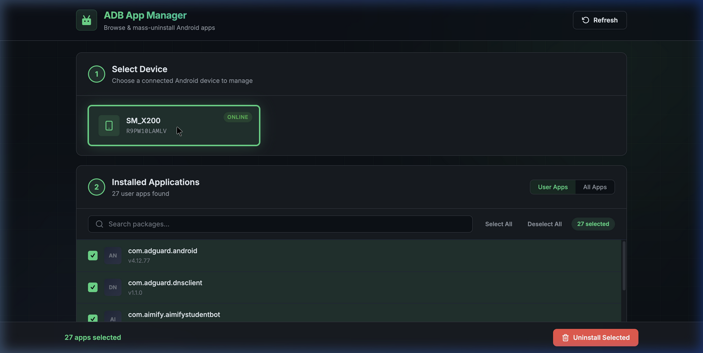

<p align="center">
  
  
  
  
</p>

# 🤖 ADB App Manager

A beautiful, modern web interface for managing Android applications via ADB (Android Debug Bridge). Browse installed apps, search packages, and **mass-uninstall** applications from any connected Android device — all from your browser.



---

## ✨ Features

| Feature | Description |
|---------|-------------|
| 📱 **Device Detection** | Auto-detects all connected Android devices with model info & status |
| 🔄 **Multi-Device Support** | Switch between multiple connected phones/tablets seamlessly |
| 📦 **App Listing** | View all user-installed or system apps with version numbers |
| 🔍 **Live Search** | Instantly filter packages by name as you type |
| ☑️ **Batch Selection** | Select All / Deselect All with individual checkboxes |
| 🗑️ **Mass Uninstall** | Remove multiple apps at once with a single click |
| ⚠️ **Confirmation Modal** | Safety confirmation dialog before any destructive action |
| 📊 **Results Dashboard** | Clear success/failure report after uninstall operations |
| 🎨 **Premium Dark UI** | Glassmorphism, micro-animations, and responsive design |

---

## 🚀 Quick Start

### Prerequisites

1. **Node.js** (v18 or higher) — [Download](https://nodejs.org/)
2. **ADB** (Android Debug Bridge) — Install via:
   ```bash
   # macOS (Homebrew)
   brew install android-platform-tools

   # Ubuntu/Debian
   sudo apt install adb

   # Windows (Scoop)
   scoop install adb
   ```
3. **USB Debugging** enabled on your Android device:
   - Go to `Settings → About Phone → Tap "Build Number" 7 times`
   - Then `Settings → Developer Options → Enable USB Debugging`

### Installation

```bash
# Clone the repository
git clone https://github.com/atul573/andrioddebugbridge.git
cd andrioddebugbridge

# Install dependencies
npm install

# Start the server
npm start
```

Open **http://localhost:3000** in your browser.

### One-liner

```bash
git clone https://github.com/atul573/andrioddebugbridge.git && cd andrioddebugbridge && npm install && npm start
```

---

## 📖 Usage Guide

### 1. Connect Your Device

Plug in your Android device via USB. Ensure USB Debugging is enabled and you've authorized the computer on the phone's prompt.

### 2. Select Device

The app will auto-detect connected devices. Click on a device card to select it.

### 3. Browse Apps

- **User Apps** — Shows only third-party installed apps (default)
- **All Apps** — Shows system + user apps (use with caution)

### 4. Search & Select

Use the search bar to filter packages. Select apps individually or use **Select All**.

### 5. Mass Uninstall

Click the red **"Uninstall Selected"** button → confirm in the modal → done!

> ⚠️ **Warning:** Uninstalling system apps (in "All Apps" mode) uses `pm uninstall -k --user 0` which disables them for the current user. This can be reversed by factory resetting. Be careful with system apps.

---

## 🏗️ Architecture

```
andrioddebugbridge/
├── server.js           # Express backend — ADB command bridge
├── public/
│   ├── index.html      # Main HTML page
│   ├── style.css       # Premium dark theme CSS
│   └── app.js          # Client-side JavaScript
├── docs/
│   └── screenshot.png  # App screenshot
├── package.json
├── vercel.json         # Vercel deployment config
├── .gitignore
├── LICENSE
└── README.md
```

### API Endpoints

| Method | Endpoint | Description |
|--------|----------|-------------|
| `GET` | `/api/devices` | List connected ADB devices |
| `GET` | `/api/packages?serial=XXX` | List user-installed packages |
| `GET` | `/api/packages/all?serial=XXX` | List all packages (system + user) |
| `POST` | `/api/uninstall` | Uninstall user packages (body: `{serial, packages[]}`) |
| `POST` | `/api/uninstall-system` | Uninstall system packages for user 0 |

---

## 🌐 Deployment

### Vercel (Static Preview)

The frontend is deployed to Vercel as a static showcase. **Note:** The ADB backend requires a local machine with USB access, so the Vercel deployment serves as a demo/preview only.

```bash
vercel --prod
```

### Local (Full Functionality)

For actual device management, always run locally:

```bash
npm start
```

---

## 🛠️ Tech Stack

- **Backend:** Node.js + Express
- **Frontend:** Vanilla HTML/CSS/JS
- **Styling:** Custom CSS with glassmorphism, CSS Grid, animations
- **Typography:** [Inter](https://fonts.google.com/specimen/Inter) (Google Fonts)
- **Device Interface:** ADB (Android Debug Bridge)

---

## 🤝 Contributing

Contributions are welcome! Here's how:

1. Fork the repository
2. Create your feature branch (`git checkout -b feature/amazing-feature`)
3. Commit your changes (`git commit -m 'Add amazing feature'`)
4. Push to the branch (`git push origin feature/amazing-feature`)
5. Open a Pull Request

---

## 📄 License

This project is licensed under the MIT License — see the [LICENSE](LICENSE) file for details.

---

## 🙏 Acknowledgments

- [Android Debug Bridge (ADB)](https://developer.android.com/tools/adb) by Google
- [Inter Typeface](https://rsms.me/inter/) by Rasmus Andersson
- Built with ❤️ for the Android community

---

<p align="center">
  <strong>Star ⭐ this repo if you found it useful!</strong>
</p>
